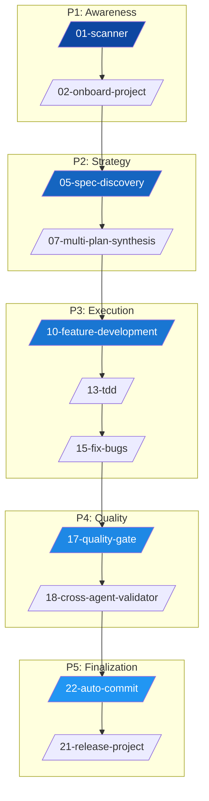

<div align="center">


# 🌌 Antigravity Agent Ecosystem (v4.0.0)
**The Ultimate Agentic Operating System for Professional Software Engineering**


[](PROJECT_METADATA.md)
[](LICENSE.md)
[](#)


---


> "The best way to predict the future is to invent it." — **Alan Kay**


</div>


## 📖 Table of Contents

- [Introduction & Philosophy](#-introduction--philosophy)
- [Architecture: The 5-Phase Lifecycle](#-architecture-the-5-phase-lifecycle)
- [Deployment Guide (Installation)](#-deployment-guide-installation)
- [The Agent Arsenal (Specialists)](#-the-agent-arsenal-specialists)
- [The Pipelines (Workflows)](#-the-pipelines-workflows)
- [Foundational Skills](#-foundational-skills)
- [Advanced Operations Matrix](#-advanced-operations-matrix)


---


## 🧠 Introduction & Philosophy

Antigravity is not just a collection of prompts; it is a **portable, self-contained Agentic Operating System (AOS)**. It is designed to be injected into any codebase to provide immediate high-level oversight, architectural governance, and automated execution.


### The Dual-Skill Model

- **Waiters (Agents)**: Explicitly triggered specialist personas (`.agent/.agents/skills/`) that handle user interaction and task execution.
- **Recipe Book (Skills/Rules)**: Implicit foundational instructions (`.agent/skills/` and `.agent/rules/`) that ensure the AI maintains high standards of integrity, safety, and performance.


---


## 🏗️ Architecture: The 5-Phase Lifecycle

Every project lifecycle in Antigravity follows a strict, non-linear progression managed by specialized workflows.





---


## 📥 Deployment Guide (Installation)

Antigravity is designed to be **injected** into any directory. To install, you only need to copy the `.agent/` and `.claude/` folders to your project root.


### 🐧 Linux / 🍎 macOS / 💻 WSL

Use `rsync` to preserve file permissions and structure:

```bash
# Navigate to your target project
cd /path/to/your-project

# Copy the core infrastructure
rsync -av --exclude='.git' "/path/to/Antigravity-Agent/.agent/" "./.agent/"
rsync -av --exclude='.git' "/path/to/Antigravity-Agent/.claude/" "./.claude/"
```


### 🪟 Windows (PowerShell)

Use `Copy-Item` with recurse:

```powershell
# Copy the .agent folder
Copy-Item -Recurse -Force "C:\Antigravity-Agent\.agent" "C:\Your-Project\.agent"

# Copy the .claude folder
Copy-Item -Recurse -Force "C:\Antigravity-Agent\.claude" "C:\Your-Project\.claude"
```


### 🚀 First-Boot Sequence

Once installed, run these two commands in order via your AI IDE (Cursor/Windsurf/Claude Code):
1. `/01-scanner` — Detects the environment and initializes project memory.
2. `/02-onboard-project` — Performs initial analysis and sets the first milestones.


---


## 🤖 The Agent Arsenal (Specialists)

Antigravity features **22 Specialist Agents**, each with a dedicated YAML persona.

| ID | Agent Name | Command | Primary Function |
|:---|:---|:---|:---|
| **01** | `deep-scan` | `/scanner` | Comprehensive directory mapping and resource identification. |
| **02** | `failure-predictor` | `/predict` | Pre-execution analysis to identify logic flaws and edge cases. |
| **03** | `research-loop` | `/research` | Recursive information gathering and documentation audit. |
| **04** | `planner` | `/plan` | Strategic roadmap generation and multi-step orchestration. |
| **05** | `synthesizer` | `/synthesize` | Merges multiple AI strategies into a single coherent plan. |
| **06** | `tdd-guide` | `/tdd-guide` | Orchestrates the Red-Green-Refactor cycle. |
| **07** | `refactor` | `/refactor` | Codebase cleanup and optimization based on Phase 3 rules. |
| **08** | `cognitive-load` | `/inspect-load` | Monitors code complexity and suggests simplifications. |
| **09** | `side-effect` | `/track-impact` | Maps downstream impacts of every local code change. |
| **10** | `state-machine` | `/inspect-state` | Audits state transitions and identifies illegal states. |
| **11** | `confidence` | `/score` | Assigns confidence ratings to proposed solutions. |
| **12** | `antibug` | `/antibug` | High-fidelity bug hunting and regression analysis. |
| **13** | `web-aesthetics` | `/ui` | UI/UX design auditor and CSS layout specialist. |
| **14** | `memory-evolve` | `/evolve` | Updates project memory and session context. |
| **15** | `context-eng` | `/context` | Optimizes the agent's context window for maximum focus. |
| **16** | `readme-arch` | `/readme` | Generates premium-grade documentation and visual guides. |
| **17** | `market-eval` | `/market` | Analyzes codebase complexity for commercial valuation. |
| **18** | `license-gen` | `/license` | Generates appropriate licensing documentation. |
| **19** | `git-author` | `/commit` | Drafts atomic, conventional commit messages from diffs. |
| **20** | `mcp-auditor` | `/mcp-audit` | Audits & maps integrated MCP tool capabilities. |
| **21** | `security-audit` | `/security` | Zero-trust security scanning and vulnerability detection. |
| **22** | `test-engineer` | `/test` | Automated test suite generation and coverage enforcement. |


---


## 🛤️ The Pipelines (Workflows)

Workflows are multi-agent recipes for complex operations. Trigger them via `/workflow-name` or their trigger phrase.
They are listed in logical ascending order of the 5-Phase software lifecycle.

| ID | Workflow | Slash Command | Trigger Phrase | Objective |
|:---|:---|:---|:---|:---|
| **01** | `Scanner` | `/01-scanner` | "Scan the project" | Build situational awareness and map directories. |
| **02** | `Onboard` | `/02-onboard-project` | "Onboard project" | Analyze legacy code and suggest initial strategy. |
| **03** | `MCP Audit` | `/03-mcp-audit` | "Scan my tools" | Audit & map integrated MCP tool capabilities. |
| **04** | `Scaffold` | `/04-scaffold-assets` | "Scaffold assets" | Initialize project structure and taxonomy. |
| **05** | `Spec` | `/05-spec-discovery` | "Discover spec" | Functional and technical spec extraction. |
| **06** | `Research` | `/06-parallel-research` | "Parallel research" | Simultaneous research on multiple technical paths. |
| **07** | `Synthesis` | `/07-multi-plan-synthesis` | "Synthesize plans" | Merge competing AI strategies into one plan. |
| **08** | `Knowledge` | `/08-knowledge-capture` | "Capture knowledge" | Distill project insights into persistent KIs. |
| **09** | `New Req` | `/09-new-requirement` | "Add requirement" | Integrate new features into an existing plan. |
| **10** | `Feature` | `/10-feature-development` | "Develop feature" | Incremental feature build cycle. |
| **11** | `Web Build`| `/11-build-website` | "Build website" | End-to-end website generation pipeline. |
| **12** | `App Build`| `/12-build-app` | "Build application" | Production-ready application build cycle. |
| **13** | `TDD Cycle` | `/13-tdd` | "Start TDD" | Disciplined Red-Green-Refactor orchestration. |
| **14** | `Debug` | `/14-debug-session` | "Debug session" | Intensive diagnostic and repair protocol. |
| **15** | `Fix Bugs` | `/15-fix-bugs` | "Fix all bugs" | Build-detected bug hunting and resolution. |
| **16** | `Performance` | `/16-performance` | "Optimize perf" | Profiling and bottleneck elimination. |
| **17** | `Quality` | `/17-quality-gate` | "Check quality" | Compliance check against design/requirements. |
| **18** | `Validator` | `/18-cross-agent-validator` | "Validate work" | Audit previous steps for hallucinations/errors. |
| **19** | `Report` | `/19-write-report` | "Write report" | Generate status reports and technical summaries. |
| **20** | `Review` | `/20-weekly-review` | "Weekly review" | Strategic audit of project progress/health. |
| **21** | `Release` | `/21-release-project` | "Finalize release" | God Mode: License, README, Packaging. |
| **22** | `Commit` | `/22-auto-commit` | "Auto commit" | Atomic, semantic commit generation loop. |


---


## 🛠️ Foundational Skills

Implicit reasoning modules that govern every agent's internal logic.

- **`03-task-decomposition`**: Breaks any request into atomic, non-overlapping tasks.
- **`07-cognitive-load-inspector`**: Monitors code complexity and suggests simplifications.
- **`08-side-effect-tracker`**: Maps the downstream impacts of every local change.
- **`14-context-engineering`**: Optimizes the agent's context window for maximum focus.
- **`15-security-engineering`**: Enforces zero-trust principles during code generation.


---


## 🧮 Advanced Operations Matrix

All agents are now augmented with the **Advanced Operations Matrix (v4.0.0)**, enabling:

- **Mathematical Simulations**: Complex arithmetic, statistics, and linear algebra.
- **Data Engineering**: Large-scale data processing using pandas, numpy, and JSON-querying.
- **Security Audits**: Automated vulnerability scanning and dependency verification.
- **Performance Benchmarking**: Integrated profiling and optimization cycles.


---


<div align="center">

Built with ❤️ by **FartinCat** — <i>"Defying the gravity of standard development."</i>

</div>