<div align="center">


# 🌌 Aether Agent Ecosystem (v4.10.0)
**The Ultimate Agentic Operating System for Professional Software Engineering**


[](AETHER.md)
[](LICENSE.md)
[](#)


---


> "The best way to predict the future is to invent it." — **Alan Kay**


</div>


## 📖 Table of Contents

- [Introduction & Philosophy](#-introduction--philosophy)
- [Architecture: The 5-Phase Lifecycle](#-architecture-the-5-phase-lifecycle)
- [Deployment Guide (Installation)](#-deployment-guide-installation)
- [The Agent Arsenal (Specialists)](#-the-agent-arsenal-specialists)
- [The Pipelines (Workflows)](#-the-pipelines-workflows)
- [Foundational Skills](#-foundational-skills)
- [Advanced Operations Matrix](#-advanced-operations-matrix)


---


## 🧠 Introduction & Philosophy

Aether Agent is not just a collection of prompts; it is a **portable, self-contained Agentic Operating System (AOS)**. It is designed to be injected into any codebase to provide immediate high-level oversight, architectural governance, and automated execution.


### The Dual-Skill Model

- **Waiters (Agents)**: Explicitly triggered specialist personas (`.agent/.agents/skills/`) that handle user interaction and task execution.
- **Recipe Book (Skills/Rules)**: Implicit foundational instructions (`.agent/skills/` and `.agent/rules/`) that ensure the AI maintains high standards of integrity, safety, and performance.


---


## 🏗️ Architecture: The 5-Phase Lifecycle

Every project lifecycle in Aether Agent follows a strict, non-linear progression managed by specialized workflows.

```mermaid
graph TD
    subgraph P1: Awareness
    SCANNER[/01-scan/]
    ONBOARDPROJECT[/02-onboard/]
    SCANNER --> ONBOARDPROJECT
    SCAFFOLDASSETS[/03-scaffold/]
    ONBOARDPROJECT --> SCAFFOLDASSETS
    SPECDISCOVERY[/04-spec/]
    SCAFFOLDASSETS --> SPECDISCOVERY
    end

    subgraph P2: Strategy
    Research[/05-research/]
    MULTIPLANSYNTHESIS[/06-plan-synthesis/]
    Research --> MULTIPLANSYNTHESIS
    KNOWLEDGECAPTURE[/07-knowledge-capture/]
    MULTIPLANSYNTHESIS --> KNOWLEDGECAPTURE
    Build[/08-build/]
    KNOWLEDGECAPTURE --> Build
    Feature[/09-feature/]
    Build --> Feature
    end

    subgraph P3: Execution
    TDD[/10-tdd/]
    DEBUGSESSION[/11-debug/]
    TDD --> DEBUGSESSION
    PERFORMANCE[/12-performance/]
    DEBUGSESSION --> PERFORMANCE
    QUALITYGATE[/13-quality-gate/]
    PERFORMANCE --> QUALITYGATE
    CROSSAGENTVALIDATOR[/14-validate/]
    QUALITYGATE --> CROSSAGENTVALIDATOR
    RELEASEPROJECT[/15-release/]
    CROSSAGENTVALIDATOR --> RELEASEPROJECT
    SYNCREGISTRY[/16-sync-registry/]
    RELEASEPROJECT --> SYNCREGISTRY
    end

    subgraph P4: Quality
    AUTOCOMMIT[/17-auto-commit/]
    end

    subgraph P5: Finalization
    READMEARCHITECT[/22-readme-architect/]
    end

    SPECDISCOVERY --> Research
    Feature --> TDD
    SYNCREGISTRY --> AUTOCOMMIT
    AUTOCOMMIT --> READMEARCHITECT

    style SCANNER fill:#0d47a1,color:#fff
    style ONBOARDPROJECT fill:#0d47a1,color:#fff
    style SCAFFOLDASSETS fill:#0d47a1,color:#fff
    style SPECDISCOVERY fill:#0d47a1,color:#fff
    style Research fill:#1565c0,color:#fff
    style MULTIPLANSYNTHESIS fill:#1565c0,color:#fff
    style KNOWLEDGECAPTURE fill:#1565c0,color:#fff
    style Build fill:#1565c0,color:#fff
    style Feature fill:#1565c0,color:#fff
    style TDD fill:#1976d2,color:#fff
    style DEBUGSESSION fill:#1976d2,color:#fff
    style PERFORMANCE fill:#1976d2,color:#fff
    style QUALITYGATE fill:#1976d2,color:#fff
    style CROSSAGENTVALIDATOR fill:#1976d2,color:#fff
    style RELEASEPROJECT fill:#1976d2,color:#fff
    style SYNCREGISTRY fill:#1976d2,color:#fff
    style AUTOCOMMIT fill:#1e88e5,color:#fff
    style READMEARCHITECT fill:#2196f3,color:#fff
```





---


## 📥 Deployment Guide (Installation)

Aether Agent is designed to be **injected** into any directory. To install, copy the agent runtime, IDE stubs, and root metadata into the folder you want to use as the new project root.


### 🐧 Linux / 🍎 macOS / 💻 WSL

Use `rsync` to preserve file permissions and structure:

```bash
# Navigate to your target project
cd /path/to/your-project

# Copy the core infrastructure
rsync -av --exclude='.git' "/path/to/Aether-Agent/.agent/" "./.agent/"
rsync -av --exclude='.git' "/path/to/Aether-Agent/.claude/" "./.claude/"
cp "/path/to/Aether-Agent/AETHER.md" "./AETHER.md"
cp "/path/to/Aether-Agent/CLAUDE.md" "./CLAUDE.md"
cp "/path/to/Aether-Agent/AGENTS.md" "./AGENTS.md"
cp "/path/to/Aether-Agent/.mcp.json" "./.mcp.json"
# Optional: copy .codex/ if your IDE uses it
```


### 🪟 Windows (PowerShell)

Use `Copy-Item` with recurse:

```powershell
# Copy the .agent folder
Copy-Item -Recurse -Force "C:\Aether-Agent\.agent" "C:\Your-Project\.agent"

# Copy the .claude folder
Copy-Item -Recurse -Force "C:\Aether-Agent\.claude" "C:\Your-Project\.claude"

# Copy root metadata and IDE stubs
Copy-Item -Force "C:\Aether-Agent\AETHER.md" "C:\Your-Project\AETHER.md"
Copy-Item -Force "C:\Aether-Agent\CLAUDE.md" "C:\Your-Project\CLAUDE.md"
Copy-Item -Force "C:\Aether-Agent\AGENTS.md" "C:\Your-Project\AGENTS.md"
Copy-Item -Force "C:\Aether-Agent\.mcp.json" "C:\Your-Project\.mcp.json"
```


### 🚀 First-Boot Sequence

Once installed, run these two commands in order via your AI IDE (Cursor/Windsurf/Claude Code/Gemini):
1. `/01-scan` — Detects the environment and initializes project memory.
2. `/03-scaffold` — Creates the portable project skeleton, including `assets/`, `docs/`, and `archived/`.

After `/01-scan`, the session context rebases to the folder you copied into. If you move the same `.agent/` bundle into a different directory, run `/01-scan` again and it will rebind to the new project root.


---


## 🤖 The Agent Arsenal (Specialists)

Aether Agent features **23 Specialist Agents**, each with a dedicated YAML persona.

| ID | Agent Name | Command | Primary Function |
|:---|:---|:---|:---|
| **01** | `deep-scan` | `/deep-scan` | Comprehensive situational awareness agent. Maps the project repository structure, dependencies, assets, and inter-module relationships. Never scans .agent/ infrastructure folders. |
| **02** | `failure-predictor` | `/failure-predictor` | Pre-execution failure prediction agent. Runs before any code execution to predict likely bugs, rule violations, and fragile areas. Operates as the system's immune system. |
| **03** | `ask` | `/ask` | Quick, precise answers to doubts with medium context. Works in tandem with deep-scan. |
| **04** | `planner` | `/planner` | Strategic breakdown of complex requirements into phased, dependency-aware implementation roadmaps. Reads Plan/ folder and archived/ history before writing a single step. |
| **05** | `synthesizer` | `/synthesizer` | Ensemble Plan Evaluation and Master Synthesis agent. Reads multiple AI plans from the Plan/ folder, reconciles them against the actual codebase, and generates a single bugless master implementation strategy. |
| **06** | `tdd-guide` | `/tdd-guide` | Strict Test-Driven Development agent. Enforces the Red-Green-Refactor cycle for every piece of logic. Writes the test first, then the minimum code to pass it, then cleans up. Never writes untested production code. |
| **07** | `python-agent` | `/python-agent` | Python-specific language agent. Encodes Python rules, instincts, and verification workflows for type-safe, idiomatic Python development. |
| **08** | `rust-agent` | `/rust-agent` | Rust-specific language agent. Encodes Rust rules, instincts, ownership preflight protocol, and verification workflows for safe, idiomatic Rust development. |
| **09** | `jsts-agent` | `/jsts-agent` | JavaScript/TypeScript-specific language agent. Encodes JS/TS rules, instincts, and verification workflows for modern, type-safe web development. |
| **10** | `c-agent` | `/c-agent` | C-specific language agent. Encodes C rules, instincts, and verification workflows for safe, defensive C programming. |
| **11** | `go-agent` | `/go-agent` | Go-specific language agent. Encodes Go rules, instincts, and verification workflows for idiomatic, concurrent Go development. |
| **12** | `antibug` | `/antibug` | Advanced bug detection agent. Works in tandem with deep-scan to identify logic flaws, memory leaks, race conditions, and unhandled edge cases. Includes historical pattern analysis from archived/ to prevent regression of previously fixed bugs. |
| **13** | `web-aesthetics` | `/web-aesthetics` | Ensures any generated vanilla CSS/JS web app features a premium, modern design. Enforces vibrant colors, glassmorphism, micro-animations, and high-quality typography over MVP placeholders. |
| **14** | `scientific-writing` | `/scientific-writing` | Specialized rules for writing physics dissertations, academic reports, and LaTeX formatting. Ensures a rigorous, objective, and consistent scientific tone. |
| **15** | `latex-bib-manager` | `/latex-bib-manager` | Automatically manages LaTeX bibliographies, enforces strictly sequential citation numbering ([1], [2]...), cleans .bib entries, and stabilizes figure floats. |
| **16** | `readme-architect` | `/readme-architect` | Generates a highly structured, comprehensive, and engaging README.md for the project from a layman's perspective. |
| **17** | `market-evaluator` | `/market-evaluator` | Evaluates the codebase and features against user requirements to estimate future market value and suggest commercial pricing tiers. |
| **18** | `commercial-license` | `/commercial-license` | Generates a custom LICENSE.md enforcing commercial fees and validation-based contributor access. |
| **19** | `git-commit-author` | `/git-commit-author` | Analyzes git diff output and generates atomic, Conventional Commit commands for copy-paste execution. |
| **20** | `code-reviewer` | `/code-reviewer` | Senior code reviewer that evaluates changes across five dimensions — correctness, readability, architecture, security, and performance. Use for thorough code review before merge. |
| **21** | `security-auditor` | `/security-auditor` | Security engineer focused on vulnerability detection, threat modeling, and secure coding practices. Use for security-focused code review, threat analysis, or hardening recommendations. |
| **22** | `test-engineer` | `/test-engineer` | QA engineer specialized in test strategy, test writing, and coverage analysis. Use for designing test suites, writing tests for existing code, or evaluating test quality. |
| **23** | `mcp-auditor` | `/mcp-auditor` | Specialist Agent. |

---


## 🛤️ The Pipelines (Workflows)

Workflows are multi-agent recipes for complex operations. Trigger them via `/workflow-name` or their trigger phrase.
They are listed in logical ascending order of the 5-Phase software lifecycle.

| ID | Workflow | Slash Command | Trigger Phrase | Objective |
|:---|:---|:---|:---|:---|
| **01** | `SCANNER` | `/01-scan` | "scanner" | Build situational awareness and map directories. |
| **02** | `ONBOARD PROJECT` | `/02-onboard` | "onboard project" | Analyze legacy code and suggest initial strategy. |
| **03** | `SCAFFOLD ASSETS` | `/03-scaffold` | "scaffold assets" | Initialize project structure and taxonomy. |
| **04** | `SPEC DISCOVERY` | `/04-spec` | "spec discovery" | Functional and technical spec extraction. |
| **05** | `Research` | `/05-research` | "research" | Workflow execution. |
| **06** | `MULTI PLAN SYNTHESIS` | `/06-plan-synthesis` | "multi plan synthesis" | Merge competing AI strategies into one plan. |
| **07** | `KNOWLEDGE CAPTURE` | `/07-knowledge-capture` | "knowledge capture" | Distill project insights into persistent KIs. |
| **08** | `Build` | `/08-build` | "build" | Workflow execution. |
| **09** | `Feature` | `/09-feature` | "feature" | Workflow execution. |
| **10** | `TDD` | `/10-tdd` | "tdd" | Disciplined Red-Green-Refactor orchestration. |
| **11** | `DEBUG SESSION` | `/11-debug` | "debug session" | Intensive diagnostic and repair protocol. |
| **12** | `PERFORMANCE` | `/12-performance` | "performance" | Profiling and bottleneck elimination. |
| **13** | `QUALITY GATE` | `/13-quality-gate` | "quality gate" | Compliance check against design/requirements. |
| **14** | `CROSS AGENT VALIDATOR` | `/14-validate` | "cross agent validator" | Audit previous steps for hallucinations/errors. |
| **15** | `RELEASE PROJECT` | `/15-release` | "release project" | God Mode: License, README, Packaging. |
| **16** | `SYNC REGISTRY` | `/16-sync-registry` | "sync registry" | Synchronize all registry files with the actual .agent/ filesystem state. |
| **17** | `AUTO COMMIT` | `/17-auto-commit` | "auto commit" | Atomic, semantic commit generation loop. |
| **18** | `MCP AUDIT` | `/21-mcp-audit` | "audit mcp servers" | Audits MCP servers, syncs validated server definitions, and writes reports under `docs/audit-reports/`. |
| **22** | `README ARCHITECT` | `/22-readme-architect` | "readme architect" | Dynamically updates the README.md to accurately reflect all active agents, workflows, and skills. |

---


## 🛠️ Foundational Skills

Implicit reasoning modules that govern every agent's internal logic.

- **`01-research-loop`**: Skill for research-loop
- **`02-language-routing`**: Skill for language-routing
- **`03-task-decomposition`**: Skill for task-decomposition
- **`04-architectural-design`**: Skill for architectural-design
- **`05-code-synthesis`**: Skill for code-synthesis
- **`06-refactor`**: Skill for refactor
- **`07-cognitive-load-inspector`**: Skill for cognitive-load-inspector
- **`08-side-effect-tracker`**: Skill for side-effect-tracker
- **`09-state-machine-inspector`**: Skill for state-machine-inspector
- **`10-confidence-scoring`**: Skill for confidence-scoring
- **`11-memory-evolution`**: Skill for memory-evolution
- **`12-commit-semantics`**: Skill for commit-semantics
- **`13-knowledge-capture`**: Capture structured knowledge about a code entry point and save it to the knowledge docs. Use when users ask to document, understand, or map code for a module, file, folder, function, or API.
- **`14-context-engineering`**: Optimizes agent context setup. Use when starting a new session, when agent output quality degrades, when switching between tasks, or when you need to configure rules files and context for a project.
- **`15-security-engineering`**: Hardens code against vulnerabilities. Use when handling user input, authentication, data storage, or external integrations. Use when building any feature that accepts untrusted data, manages user sessions, or interacts with third-party services.
- **`16-api-design`**: Guides stable API and interface design. Use when designing APIs, module boundaries, or any public interface. Use when creating REST or GraphQL endpoints, defining type contracts between modules, or establishing boundaries between frontend and backend.
- **`17-spec-compliance`**: Verifies code implements exactly what documentation specifies for blockchain audits. Use when comparing code against whitepapers, finding gaps between specs and implementation, or performing compliance checks for protocol implementations.
- **`18-memory-management`**: Use AI DevKit memory via CLI commands. Search before non-trivial work, store verified reusable knowledge, update stale entries, and avoid saving transcripts, secrets, or one-off task progress.
- **`19-performance-profiling`**: Optimizes application performance. Use when performance requirements exist, when you suspect performance regressions, or when Core Web Vitals or load times need improvement. Use when profiling reveals bottlenecks that need fixing.
- **`20-stitch-ui`**: Unified entry point for Stitch design work. Handles prompt enhancement (UI/UX keywords, atmosphere), design system synthesis (.stitch/DESIGN.md), and high-fidelity screen generation/editing via Stitch MCP.
- **`21-mcp-audit`**: This protocol defines the technical procedure for auditing the Model Context Protocol (MCP) servers integrated into the Aether Agent. It is the only protocol authorized to bypass the `.agent/` exclusion rule for infrastructure discovery.
- **`22-registry-synchronizer`**: Run it with: ```bash python .agent/scripts/sync_registry.py ```

---


## 🧮 Advanced Operations Matrix

All agents are now augmented with the **Advanced Operations Matrix (v4.0.0)**, enabling:

- **Mathematical Simulations**: Complex arithmetic, statistics, and linear algebra.
- **Data Engineering**: Large-scale data processing using pandas, numpy, and JSON-querying.
- **Security Audits**: Automated vulnerability scanning and dependency verification.
- **Performance Benchmarking**: Integrated profiling and optimization cycles.


---


<div align="center">

Built with ❤️ by **FartinCat** — <i>"Transcending the limits of standard development."</i>

</div>