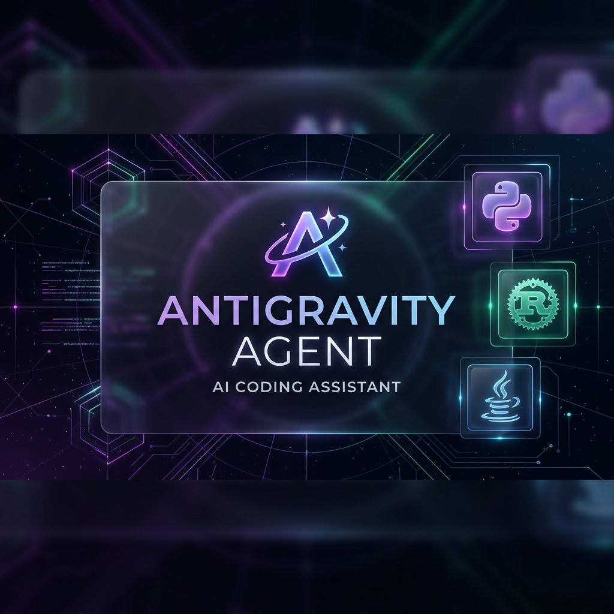

# 🌌 Antigravity Agent Ecosystem
**The Next-Gen Agentic Framework for Autonomous Coding**

---

"If you want to find the secrets of the universe, think in terms of energy, frequency and vibration." — **Nikola Tesla**

## 🧠 Part 1: The Architecture
Antigravity uses a **Dual-Skill Architecture** inspired by enterprise agent frameworks. It separates the user interface from the underlying knowledge base.

### 🍽️ The "Waiters" (UI-Facing Skills)
**Location:** `.agent/.agents/skills/`
These are the Agents you interact with directly. They have dedicated folders with a "Brain" (`SKILL.md`) and a "Uniform" (`openai.yaml`) that registers them as buttons in your chat UI.

### 📖 The "Recipe Book" (Foundational Skills)
**Location:** `.agent/skills/`
Flat markdown files (e.g., `architectural-design.md`) that agents read silently to learn advanced rules before writing code. No UI presence, just raw intelligence.

---

## 🚀 Part 2: Quick Start & Usage

### Method A: AI IDE (Cursor, Windsurf, Copilot)
1. **Slash Commands**: Type `/` in the chat bar (e.g., `/planner`) to invoke an agent.
2. **Workflows**: Click the `+` button and select a workflow (e.g., `scanner`) to run a sequence of tasks.

### Method B: Plain Chat (Claude, ChatGPT, Gemini)
1. Open an agent's `SKILL.md` (e.g., `.agent/.agents/skills/ask/SKILL.md`).
2. Copy the content and paste it as your first message:
   > "You are operating under the following rules: [paste SKILL.md here]"

---

## 📑 Agent Quick-Reference

| Command | Name | Purpose | Brand Color |
| :--- | :--- | :--- | :--- |
| `/ask` | **Ask Agent** | Quick, precise answers to doubts | Blue `#3B82F6` |
| `/deep-scan` | **Deep Scan** | Repo mapping & awareness | Emerald `#10B981` |
| `/planner` | **Planner** | Strategic roadmaps & phases | Purple `#8B5CF6` |
| `/antibug` | **Antibug** | Bug hunting & patching | Red `#EF4444` |
| `/web-aesthetics`| **Aesthetics** | Premium UI enforcement | Vibrant Gradient |
| `/release` | **Releaser** | Market eval & licensing | Gold |

---

## 💾 Session Context & Memory
The system uses `.agent/session-context.md` to maintain state across chats.

**How to use it effectively:**
1. **At the end of a session**: The AI updates this file with your progress.
2. **At the start of a new session**: Paste the contents of `session-context.md` into your first message.
3. **Why?**: This gives the AI "long-term memory," ensuring it knows exactly what was done and what needs to happen next.

---

## 🔍 The Scanner Workflow
Confused about the repo? Run the **Scanner Workflow**.
1. It runs a `/deep-scan` to map everything.
2. It uses the `/ask` agent to summarize recent changes.
3. It explains how to use critical files like `session-context.md` and `PROJECT_METADATA.md`.

---

## 🛠️ Build Your Own Agent
1. Create a folder in `.agent/.agents/skills/`.
2. Add `SKILL.md` (The rules).
3. Add `agents/openai.yaml` (The UI config).
4. Register in `.agent/antigravity-agent-install-state.json`.

---

Developed by <b>FartinCat</b> | 2026 Antigravity Ecosystem

