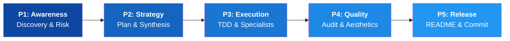

<div align="center">


# 🌌 Antigravity Agent Ecosystem
**The v3.0.0 "Exponential" AI Orchestration Framework for Professional Developers**

[](PROJECT_METADATA.md)
[](LICENSE.md)
[](#)

---

> "If you want to find the secrets of the universe, think in terms of energy, frequency and vibration." — **Nikola Tesla**

</div>

### 💰 Commercial Licensing
Antigravity is a **premium, paid ecosystem**. The core "Brain" (the `.agent` folder) is a proprietary asset. To unlock the full agentic power of the 58 orchestrated components, you must purchase a license.

**[Click here to purchase and download the Core (.agent folder)](https://antigravity.lemonsqueezy.com/checkout/buy/35a2a620-3f40-4aea-9e0d-1d58819ae5f1)**
*Free institutional access is available for verified academic researchers.*

---

## 🧠 Introduction & Architecture
Antigravity is not a single agent; it is a **portable AI Operating System**. It uses a **Dual-Skill Architecture** to govern development:

- **🍽️ The "Waiters" (Agents)**: UI-facing specialists that interact with you directly via slash commands (`.agent/.agents/skills/`).
- **📖 The "Recipe Book" (Foundational Rules)**: Hidden markdown files that dictate AI behavior, safety, and architectural standards in the background (`.agent/skills/` and `.agent/rules/`).

### 🏗️ The 5-Phase Lifecycle
Every action in Antigravity is bound by a rigorous execution model. This prevents "shotgun coding" and ensures enterprise-grade quality.



---

## 📥 Installation & Deployment Guide
You can seamlessly integrate the Antigravity Brain into **any** project directory. **You only ever need to copy the `.agent/` folder.**

### Step 1: Copying the Core (`.agent/`)

**Method 1: rsync (Recommended for Linux/WSL/macOS)**
```bash
rsync -av --exclude='.git' "/path/to/Antigravity Agent/.agent/" "/path/to/YOUR_PROJECT/.agent/"
```

**Method 2: PowerShell (Windows)**
```powershell
Copy-Item -Recurse -Force "D:\path\to\Antigravity Agent\.agent" "D:\path\to\YOUR_PROJECT\.agent"
```

### Step 2: First-Contact Booting
1. **Open your AI IDE** (Cursor, Windsurf, VS Code) in the new project directory.
2. **Run `/01-scanner`** — Always the first step. It detects the directory change, archives old context, and initializes fresh memory.
3. **Run `/02-onboard-project`** — Analyzes your existing code and suggests the first 3 strategic moves.
4. **Proceed with your workflow.**

---

## 🤖 The Arsenal: Agents (Explicit Triggers)
These are your active tools. To use them in a plain chat (Claude.ai/ChatGPT), copy their `SKILL.md` and use the **Trigger Sentence**.

### 🔍 01-Deep Scan
- **Purpose**: Maps the full project architecture and dependency tree.
- **Trigger**: `/scanner` or *"Run a Deep Scan on this directory structure."*

### 🛡️ 02-Failure Predictor
- **Purpose**: Predicts bugs and rule violations before you write a single line.
- **Trigger**: `/failure-predictor` or *"Predict potential failures for this proposed change."*

### 💬 03-Ask
- **Purpose**: High-precision doubt resolution and logic querying.
- **Trigger**: `/ask [query]` or *"Acting as the Ask agent, clarify this: [query]."*

### 🗺️ 04-Planner
- **Purpose**: Generates phased, dependency-aware implementation roadmaps.
- **Trigger**: `/planner` or *"Build a phased roadmap for [feature]."*

### 🧬 05-Synthesizer
- **Purpose**: Merges multiple AI plans (Claude + GPT + Gemini) into one MASTER_PLAN.md.
- **Trigger**: `/synthesizer` or *"Synthesize these attached plans into one master blueprint."*

### 🧪 06-TDD Guide
- **Purpose**: Enforces strict Red-Green-Refactor development.
- **Trigger**: `/tdd-guide` or *"Use TDD Guide to write tests before logic."*

### 🐍 07-Python / 🦀 08-Rust / ⚡ 09-JS-TS
- **Purpose**: Language-specific specialists with custom optimization rules.
- **Trigger**: `/python`, `/rust`, or `/jsts`.

### 🐛 12-Antibug
- **Purpose**: Deep logic auditing and automated patching.
- **Trigger**: `/antibug` or *"Diagnose this error and generate a patch."*

### ✨ 13-Web Aesthetics
- **Purpose**: Premium UI/UX enforcement (Gradients, Glassmorphism, Micro-animations).
- **Trigger**: `/web-aesthetics` or *"Apply premium aesthetics to this UI component."*

### 📝 19-Commit Author
- **Purpose**: Generates atomic, Conventional Commit commands.
- **Trigger**: `/commit-author` or *"Generate git commit commands for my changes."*

---

## 📖 The Recipe Book: Rules & Skills (Automatic)
These run silently in the background to ensure consistency and safety.

| # | Rule (Governance) | Background Action |
| :--- | :--- | :--- |
| 00 | `workflow-orchestration` | Enforces the 5-phase lifecycle numbering. |
| 02 | `integrity` | Prohibits "shotgun coding" and protects system files. |
| 03 | `instincts` | Fires warnings when code looks fragile or complex. |
| 04 | `verification-gates` | Blocks execution if confidence scores are too low. |
| 11 | `git-awareness` | Enforces atomic commits and semantic history. |
| 13 | `self-improvement` | Evolves agent skills based on successful interactions. |

| # | Skill (Foundational) | Background Action |
| :--- | :--- | :--- |
| 01 | `research-loop` | Forces agents to check `Plan/` and `dump/` before acting. |
| 02 | `language-routing` | Dispatches tasks to the correct language specialist. |
| 03 | `task-decomposition` | Breaks large tasks into atomic steps automatically. |
| 07 | `cognitive-load-inspector`| Measures and reduces code complexity during generation. |
| 08 | `side-effect-tracker` | Maps downstream impacts of every code change. |

---

## 🛤️ The Pipelines: Workflows Deconstructed
Workflows are multi-step recipes that combine Agents and Skills for complex operations.

### 🚀 `02-onboard-project` (First Contact)
- **Best For**: Understanding a legacy codebase you've never seen before.
- **Composition**: `/scanner` + `/ask` + `research-loop` + Language Specialist.

### 🏗️ `05b-build-app` (End-to-End Build)
- **Best For**: Building a production-ready application from scratch.
- **Composition**: `/planner` → `/tdd-guide` → `/antibug` → `/readme-architect`.

### 🐛 `07-fix-bugs` (The Exterminator)
- **Best For**: Resolving persistent, elusive logic errors.
- **Composition**: `/scanner` + `/failure-predictor` + `/antibug` + `side-effect-tracker`.

### ⚖️ `10-cross-agent-validator` (The Audit)
- **Best For**: Verifying that previous agents didn't "hallucinate" progress.
- **Composition**: Multi-step file existence and logic checks.

### 📝 `12-auto-commit` (The Closer)
- **Best For**: Generating clean, professional git history at the end of a session.
- **Composition**: `/commit-author` + `git-awareness` + `commit-semantics`.

---

## 💾 Mastering Session Memory
Antigravity maintains state across session restarts via `session-context.md`.

1. **To Save State**: At the end of a session, use: *"Update the session context with our progress."*
2. **To Load State**: At the start of a new session, copy `.agent/session-context.md` into the chat.

---

<div align="center">
Developed by <b>FartinCat</b> | 2026 Antigravity Ecosystem<br/>
<i>"Continuous improvement is better than delayed perfection."</i>
</div>
