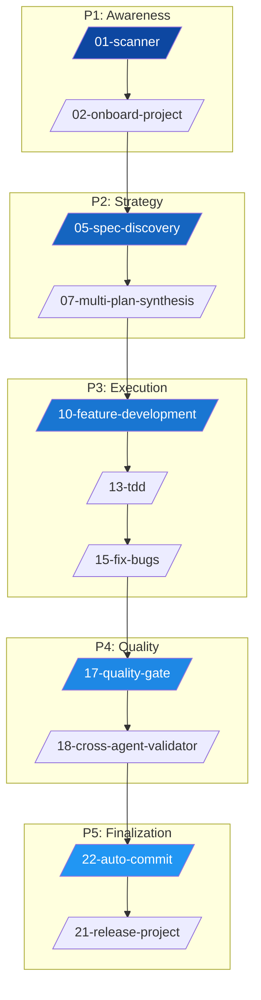

<div align="center">


# 🌌 Antigravity Agent Ecosystem (v4.2.0)
**The Ultimate Agentic Operating System for Professional Software Engineering**


[](PROJECT_METADATA.md)
[](LICENSE.md)
[](#)


---


> "The best way to predict the future is to invent it." — **Alan Kay**


</div>


## 📖 Table of Contents

- [Introduction & Philosophy](#-introduction--philosophy)
- [Architecture: The 5-Phase Lifecycle](#-architecture-the-5-phase-lifecycle)
- [Deployment Guide (Installation)](#-deployment-guide-installation)
- [The Agent Arsenal (Specialists)](#-the-agent-arsenal-specialists)
- [The Pipelines (Workflows)](#-the-pipelines-workflows)
- [Foundational Skills](#-foundational-skills)
- [Advanced Operations Matrix](#-advanced-operations-matrix)


---


## 🧠 Introduction & Philosophy

Antigravity is not just a collection of prompts; it is a **portable, self-contained Agentic Operating System (AOS)**. It is designed to be injected into any codebase to provide immediate high-level oversight, architectural governance, and automated execution.


### The Dual-Skill Model

- **Waiters (Agents)**: Explicitly triggered specialist personas (`.agent/.agents/skills/`) that handle user interaction and task execution.
- **Recipe Book (Skills/Rules)**: Implicit foundational instructions (`.agent/skills/` and `.agent/rules/`) that ensure the AI maintains high standards of integrity, safety, and performance.


---


## 🏗️ Architecture: The 5-Phase Lifecycle

Every project lifecycle in Antigravity follows a strict, non-linear progression managed by specialized workflows.





---


## 📥 Deployment Guide (Installation)

Antigravity is designed to be **injected** into any directory. To install, you only need to copy the `.agent/` and `.claude/` folders to your project root.


### 🐧 Linux / 🍎 macOS / 💻 WSL

Use `rsync` to preserve file permissions and structure:

```bash
# Navigate to your target project
cd /path/to/your-project

# Copy the core infrastructure
rsync -av --exclude='.git' "/path/to/Antigravity-Agent/.agent/" "./.agent/"
rsync -av --exclude='.git' "/path/to/Antigravity-Agent/.claude/" "./.claude/"
```


### 🪟 Windows (PowerShell)

Use `Copy-Item` with recurse:

```powershell
# Copy the .agent folder
Copy-Item -Recurse -Force "C:\Antigravity-Agent\.agent" "C:\Your-Project\.agent"

# Copy the .claude folder
Copy-Item -Recurse -Force "C:\Antigravity-Agent\.claude" "C:\Your-Project\.claude"
```


### 🚀 First-Boot Sequence

Once installed, run these two commands in order via your AI IDE (Cursor/Windsurf/Claude Code):
1. `/01-scanner` — Detects the environment and initializes project memory.
2. `/02-onboard-project` — Performs initial analysis and sets the first milestones.


---


## 🤖 The Agent Arsenal (Specialists)

Antigravity features **22 Specialist Agents**, each with a dedicated YAML persona.

| ID | Agent Name | Command | Primary Function |
|:---|:---|:---|:---|
| **01** | `deep-scan` | `/deep-scan` | Specialist Agent. |
| **02** | `failure-predictor` | `/failure-predictor` | Specialist Agent. |
| **03** | `ask` | `/ask` | Specialist Agent. |
| **04** | `planner` | `/planner` | Create a strategic implementation plan — single-agent version of /plan |
| **05** | `synthesizer` | `/synthesizer` | Specialist Agent. |
| **06** | `tdd-guide` | `/tdd-guide` | Enforce strict TDD Red-Green-Refactor cycle |
| **07** | `python-agent` | `/python-agent` | Specialist Agent. |
| **08** | `rust-agent` | `/rust-agent` | Specialist Agent. |
| **09** | `jsts-agent` | `/jsts-agent` | Specialist Agent. |
| **10** | `c-agent` | `/c-agent` | Specialist Agent. |
| **11** | `go-agent` | `/go-agent` | Specialist Agent. |
| **12** | `antibug` | `/antibug` | Deep logical audit and root-cause bug fixing |
| **13** | `web-aesthetics` | `/web-aesthetics` | Audit and upgrade UI/UX to premium standards |
| **14** | `scientific-writing` | `/scientific-writing` | Specialist Agent. |
| **15** | `latex-bib-manager` | `/latex-bib-manager` | Specialist Agent. |
| **16** | `readme-architect` | `/readme-architect` | Specialist Agent. |
| **17** | `market-evaluator` | `/market-evaluator` | Specialist Agent. |
| **18** | `commercial-license` | `/commercial-license` | Specialist Agent. |
| **19** | `git-commit-author` | `/git-commit-author` | Specialist Agent. |
| **20** | `code-reviewer` | `/code-reviewer` | Specialist Agent. |
| **20** | `mcp-auditor` | `/mcp-auditor` | Specialist Agent. |
| **21** | `security-auditor` | `/security-auditor` | Specialist Agent. |
| **22** | `test-engineer` | `/test-engineer` | Specialist Agent. |

---


## 🛤️ The Pipelines (Workflows)

Workflows are multi-agent recipes for complex operations. Trigger them via `/workflow-name` or their trigger phrase.
They are listed in logical ascending order of the 5-Phase software lifecycle.

| ID | Workflow | Slash Command | Trigger Phrase | Objective |
|:---|:---|:---|:---|:---|
| **01** | `SCANNER` | `/01-scanner` | "scanner" | Build situational awareness and map directories. |
| **02** | `ONBOARD PROJECT` | `/02-onboard-project` | "onboard project" | Analyze legacy code and suggest initial strategy. |
| **03** | `MCP AUDIT` | `/03-mcp-audit` | "mcp audit" | Audit & map integrated MCP tool capabilities. |
| **04** | `SCAFFOLD ASSETS` | `/04-scaffold-assets` | "scaffold assets" | Initialize project structure and taxonomy. |
| **05** | `SPEC DISCOVERY` | `/05-spec-discovery` | "spec discovery" | Functional and technical spec extraction. |
| **06** | `PARALLEL RESEARCH` | `/06-parallel-research` | "parallel research" | Simultaneous research on multiple technical paths. |
| **07** | `MULTI PLAN SYNTHESIS` | `/07-multi-plan-synthesis` | "multi plan synthesis" | Merge competing AI strategies into one plan. |
| **08** | `KNOWLEDGE CAPTURE` | `/08-knowledge-capture` | "knowledge capture" | Distill project insights into persistent KIs. |
| **09** | `NEW REQUIREMENT` | `/09-new-requirement` | "new requirement" | Integrate new features into an existing plan. |
| **10** | `FEATURE DEVELOPMENT` | `/10-feature-development` | "feature development" | Incremental feature build cycle. |
| **11** | `05A BUILD WEBSITE` | `/11-build-website` | "05a build website" | End-to-end website generation pipeline. |
| **12** | `05B BUILD APP` | `/12-build-app` | "05b build app" | Production-ready application build cycle. |
| **13** | `TDD` | `/13-tdd` | "tdd" | Disciplined Red-Green-Refactor orchestration. |
| **14** | `DEBUG SESSION` | `/14-debug-session` | "debug session" | Intensive diagnostic and repair protocol. |
| **15** | `FIX BUGS` | `/15-fix-bugs` | "fix bugs" | Build-detected bug hunting and resolution. |
| **16** | `PERFORMANCE` | `/16-performance` | "performance" | Profiling and bottleneck elimination. |
| **17** | `QUALITY GATE` | `/17-quality-gate` | "quality gate" | Compliance check against design/requirements. |
| **18** | `CROSS AGENT VALIDATOR` | `/18-cross-agent-validator` | "cross agent validator" | Audit previous steps for hallucinations/errors. |
| **19** | `WRITE REPORT` | `/19-write-report` | "write report" | Generate status reports and technical summaries. |
| **20** | `WEEKLY REVIEW` | `/20-weekly-review` | "weekly review" | Strategic audit of project progress/health. |
| **21** | `RELEASE PROJECT` | `/21-release-project` | "release project" | God Mode: License, README, Packaging. |
| **22** | `README ARCHITECT` | `/22-readme-architect` | "readme architect" | Dynamically updates the README.md to accurately reflect all active agents, workflows, and skills. |
| **23** | `SYNC REGISTRY` | `/23-sync-registry` | "sync registry" | Synchronize all registry files with the actual .agent/ filesystem state. |
| **24** | `AUTO COMMIT` | `/24-auto-commit` | "auto commit" | Atomic, semantic commit generation loop. |

---


## 🛠️ Foundational Skills

Implicit reasoning modules that govern every agent's internal logic.

- **`01-research-loop`**: This is the core investigative protocol used by all UI agents before generating any output. It produces the "DeepDive" effect — agents that investigate before they respond, not agents that guess immediately.
- **`02-language-routing`**: This skill detects the programming language(s) of the current task and routes to the correct language-specific agent for specialized handling.
- **`03-task-decomposition`**: This skill ensures that every task given to an LLM is small enough to be solved correctly, even by weaker models.
- **`04-architectural-design`**: This foundational skill dictates how the `03-planner` and `04-synthesizer` agents structure complex systems. It enforces professional engineering standards to prevent technical debt.
- **`05-code-synthesis`**: This skill provides the algorithmic logic for the `04-synthesizer` agent to merge disparate AI perspectives (e.g., plans from Claude, DeepSeek, GPT-4o) into a single authoritative `MASTER_PLAN.md`.
- **`06-refactor`**: This file contains the foundational principles used by the `tdd-guide` agent during Phase 3 (Refactor) and by the `antibug` agent when proposing structural improvements.
- **`07-cognitive-load-inspector`**: Purpose: Measures the cognitive complexity of functions and blocks code that exceeds safe thresholds for LLM reasoning.
- **`08-side-effect-tracker`**: Purpose: Detects global state mutation inside functions whose names imply purity.
- **`09-state-machine-inspector`**: Purpose: Detects classes/modules that manage state through multiple boolean flags instead of a unified state type (enum/union).
- **`10-confidence-scoring`**: Every LLM output is assigned a confidence score before acceptance. This score determines which verification gates must be passed.
- **`11-memory-evolution`**: This skill defines the three-tier memory system and the evolution logic that promotes patterns from session memory → project memory → global memory.
- **`12-commit-semantics`**: This foundational skill dictates how the `13-git-commit-author` reads `git diff` outputs and structures version control history.
- **`13-knowledge-capture`**: Build structured understanding of code entry points with an analysis-first workflow.
- **`14-context-engineering`**: ## Overview
- **`15-security-engineering`**: ## Overview
- **`16-api-design`**: ## Overview
- **`17-spec-compliance`**: Use this skill when you need to:
- **`18-memory-management`**: Use `npx ai-devkit@latest memory ...` as the durable knowledge layer.
- **`19-performance-profiling`**: ## Overview
- **`20-stitch-ui`**: You are an expert Design Systems Lead and Prompt Engineer specializing in the Stitch MCP server. Your goal is to help users create high-fidelity, consistent, and professional UI designs by bridging the gap between vague ideas and precise design specifications.
- **`22-mcp-audit`**: This protocol defines the technical procedure for auditing the Model Context Protocol (MCP) servers integrated into the Antigravity Agent. It is the only protocol authorized to bypass the `.agent/` exclusion rule for infrastructure discovery.
- **`22-registry-synchronizer`**: ## Purpose

---


## 🧮 Advanced Operations Matrix

All agents are now augmented with the **Advanced Operations Matrix (v4.0.0)**, enabling:

- **Mathematical Simulations**: Complex arithmetic, statistics, and linear algebra.
- **Data Engineering**: Large-scale data processing using pandas, numpy, and JSON-querying.
- **Security Audits**: Automated vulnerability scanning and dependency verification.
- **Performance Benchmarking**: Integrated profiling and optimization cycles.


---


<div align="center">

Built with ❤️ by **FartinCat** — <i>"Defying the gravity of standard development."</i>

</div>