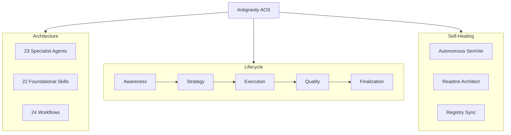

# Antigravity Agent Ecosystem Capabilities

## Overview
The Antigravity Agent Ecosystem (v4.2.x) is a fully autonomous, highly structured "God Mode" Agentic Operating System. It is designed to be injected into any codebase (by copying the `.agent/` and `.claude/` directories) to provide immediate high-level oversight, architectural governance, and automated execution.

Its core capability lies in its **Dual-Skill Architecture**:
- **Waiters (Specialist Agents)**: 23 distinct personas (e.g., planners, language-specific experts, security auditors, code reviewers) that execute precise, bounded tasks.
- **Recipe Book (Foundational Skills)**: 22 underlying governance rules that dictate *how* AI agents think. This enforces Test-Driven Development (TDD), side-effect tracking, cognitive load limits, and confidence scoring.

## Implementation Details & Core Capabilities

### 1. The 5-Phase Software Lifecycle
The ecosystem breaks software development down into 24 sequentially numbered workflows, mapped across 5 phases:
- **P1: Awareness** (01-04): Scans the repository, onboards legacy code, audits MCPs, and scaffolds missing assets.
- **P2: Strategy** (05-09): Conducts parallel AI research, synthesizes multiple plans into one master plan, and captures deep knowledge.
- **P3: Execution** (10-16): Drives the actual coding via TDD cycles, debugging swarms, and performance profiling. Features dedicated `build-website` and `build-app` pipelines.
- **P4: Quality** (17-20): Enforces spec compliance, conducts cross-agent validation to prevent hallucinations, and runs weekly reviews.
- **P5: Finalization** (21-24): The "God Mode" sequence. Evaluates commercial value, generates strict licenses, automates the README via the `readme-architect` Python engine, synchronizes the filesystem registry, and chunks out atomic `git commit` bash blocks.

### 2. Autonomous Self-Maintenance
- **README Architect**: Uses a persistent Python engine to dynamically rebuild `README.md` flowcharts and extract accurate trigger sentences from YAML frontmatter.
- **Semantic Versioning Engine**: A Git Porcelain-based script (`sync_registry.py`) that calculates patch vs minor version bumps automatically based on diff footprint.
- **Output Routing**: Prevents root directory pollution by automatically routing AI artifacts (plans, reports, evaluations) into organized `docs/` folders.

### 3. Advanced Engineering Operations
- **Micro-Inspector Swarm**: Embedded skills like `side-effect-tracker`, `state-machine-inspector`, and `cognitive-load-inspector` actively scan AI-generated code for technical debt before it is accepted.
- **Multi-Plan Synthesis**: Instead of relying on one AI's first guess, the system can generate parallel plans (e.g., from Claude, GPT-4, DeepSeek) and use a `synthesizer` agent to merge them into a single, bugless master strategy.
- **God Mode Release**: Generates commercial pricing tiers based on complexity, writes licenses, packages zip archives, and sets up atomic commits with a single command (`/21-release-project`).

## Dependencies
- **Model Context Protocol (MCP)**: Native integration with 21st-dev-magic, StitchMCP, figma-remote, MongoDB, Playwright, and Supabase.
- **Python**: Required for the core Registry Synchronization and README Architecture scripts.
- **Git**: Required for continuous semantic versioning.

## Visual Diagrams

## Additional Insights
Antigravity does not act like a standard coding assistant; it acts like a Principal Engineer. It demands that specs are written before code, tests are written before implementation, and infrastructure is strictly separated from the application's source code.

## Metadata
- **Analysis Date**: 2026-05-09
- **System Version**: v4.2.3
- **Primary Source**: `.agent/` architecture registry and `README.md`.

## Next Steps
- Run `/03-mcp-audit` to evaluate available external tools.
- Run `/17-market-evaluator` to analyze codebase commercial worth.
- Use `/08-knowledge-capture` to document specific features of your actual project code.
